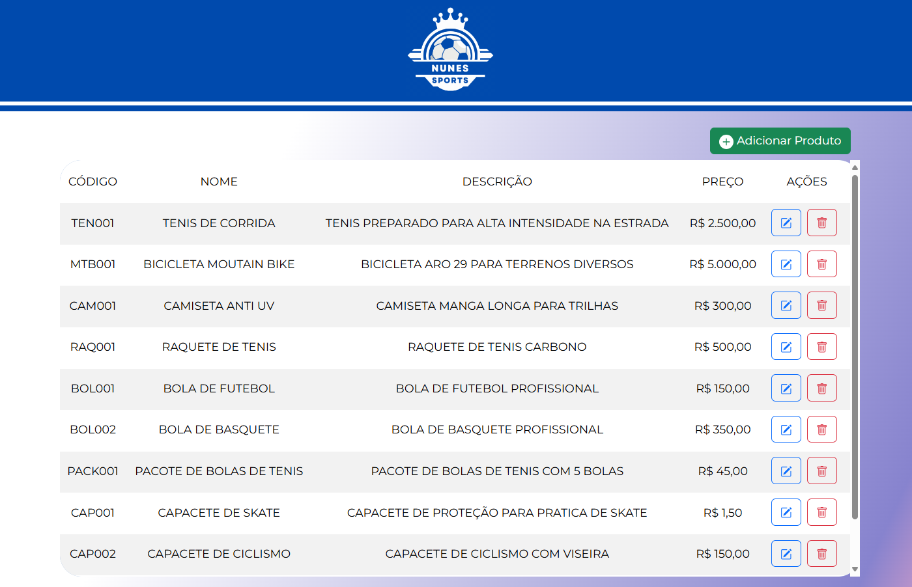
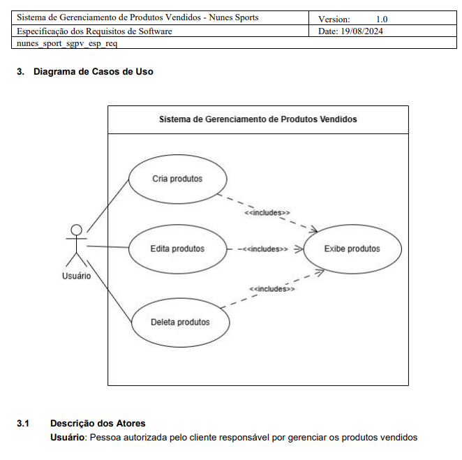
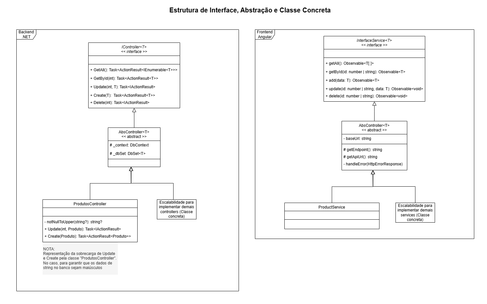

<h1 align="center">Aplicação: Nunes Sports</h1>



## Sobre o projeto
Este projeto é um sistema de gerenciamento de produtos vendidos. Ele foi construído utilizando .NET 8.0 no backend e Angular 18.2 no frontend, com SQLite como banco de dados. A escolha do banco de dados em SQLite tem como objetivo facilitar na distribuição a quem for testar a aplicação, porém, comenda-se a utilização de ferramentas mais robustas como PostgreSQL.

## Tecnologias Utilizadas
<table>
  <thead align="center">
    <tr border: none;>
      <td><b>BACKEND</b></td>
      <td><b>FRONTEND</b></td>
      <td><b>BANCO DE DADOS</b></td>
    </tr>
  </thead>
  <tbody align="center">
    <tr>
      <td>
        
      </td>
      <td>
        
        
      </td>
      <td>
        
      </td>
    </tr>
  </tbody>
</table>

## Pré-requisitos
Para rodar este projeto, você precisará ter instalado:

- [.NET 8.0 SDK](https://dotnet.microsoft.com/pt-br/download/dotnet/8.0)
- [Node.js (inclui o npm)](https://nodejs.org/pt)
- Angular CLI
  - Rode no terminal o comando `npm install -g @angular/cli`

## Configuração do Ambiente e rodando aplicação
_Os comandos estarão no padrão CMD_
1. No terminal, clone o repositório e navegue até o diretório da aplicação:
```bash
git clone https://github.com/RonanBenitis/nunessports.git
cd nunessports
cd _NunesSportsApp
```

### Configurando e incializando Backend (.NET)
_Partindo do diretório raiz da aplicação (`_NunesSportsApp`)_
1. Acessando o diretório do banco de dados:
```bash
cd NunesSports
```

2. Restaure as ferramentas do .NET (incluindo dotnet-ef):
```bash
dotnet restore
dotnet tool restore
```

3. Inicialize o servidor de banco de dados:
```bash
dotnet run --launch-profile https
```
O backend estará disponível em [https://localhost:7196](https://localhost:7196)
- Atenção, protoclo HTTPS

### Configurando inicializando Frontend (Angular)
_Partindo do diretório raiz da aplicação (`_NunesSportsApp`)_ 
1. Acessando o diretório do banco de dados:
```bash
cd angular-nunessports
```
2. Instale as dependências do projeto Angular
```bash
npm install
```
3. Execute o servidor de desenvolvimento Angular:
```bash
ng serve --open
```
O frontend estará disponível em [http://localhost:4200](http://localhost:4200/).
- _Atenção, protocolo HTTP_


## Construção do projeto
<div style="display: flex; justify-content: center; align-items: center;">
  <div style="background-color: #004aad; height: 200px; width: 300px;"></div>
  
  <div style="background-color: #004aad; height: 200px; width: 300px;"></div>
</div>

### Indice
- [Sobre o projeto](#sobre-o-projeto)
- [Tecnologias Utilizadas](#tecnologias-utilizadas)
- [Pré-requisitos](#pré-requisitos)
- [Configuração do Ambiente e rodando aplicação](#configuração-do-ambiente-e-rodando-aplicação)
  - [Configurando e incializando Backend (.NET)](#configurando-e-incializando-backend-net)
  - [Configurando inicializando Frontend (Angular)](#configurando-inicializando-frontend-angular)
- [Construção do projeto](#construção-do-projeto)
  - [Indice](#indice)
  - [Introdução](#introdução)
  - [Artefatos documentais](#artefatos-documentais)
  - [Regras de negócio](#regras-de-negócio)
    - [Regra de inserção de dados](#regra-de-inserção-de-dados)
  - [Arquitetura, interfaces e abstrações](#arquitetura-interfaces-e-abstrações)
    - [MVC](#mvc)
    - [Interfaces e abstração](#interfaces-e-abstração)
  - [Interface do usuário](#interface-do-usuário)
  - [Considerações finais](#considerações-finais)

### Introdução
Este projeto foi desenvolvido para atender aos requisitos do cliente fictício "Nunes Sport", empresa de ramo esportivos, o qual necessitava de um sistema para controle de seus produtos vendidos.

Resumindo a sua demanda, solicitou-se um sistema para exibição, criação, edição e deleção de seus produtos vendidos, sendo necessário possuir, na tabela de produtos:
- Nome do produto
- Código do produto
- Descrição do produto
- Preço do produto

O objetivo deste trabalho, então, foi criar uma pángina web que realize CRUD (Create-Read-Update-Delete).

### Artefatos documentais
O projeto deu-se inicio no planejamento através dos artefatos documentais de diagrama de Casos de Uso, documentos de Caso de Uso (que explica cada caso) e documento de Especificação de Requisitos.

Todos estes documentos poderão ser acessados no diretório chamado [UML](uml).



### Regras de negócio
Ao se tratar de uma aplicação em ambiente real, a realização de inferências referente à Regra de Negócios não é desejada, sendo recomendada realização de reuniões com stakeholders para elicitação e esclarecimento de requisitos para mitigar ruídos de conexão.

Neste caso, abstrai-se a questão acima e realizar-se-a inferências para trazer maior especificação ao escopo do projeto.

Para este projeto, o cliente Nunes Sports:
- Já possui lógica de código de produto. O sistema, então, disponibilizará para o usuário inserir o código ao invés de utilizar ID incremental do banco de dados como seu código.
  - Porém, o banco de dados **permanecerá gerando ID ao produto**, para adicionar camada de segurança caso o cliente opte por alterar a regra de negócio futuramente.
  - A lógica de codificação fornecida pelo cliente possuirá valores numéricos e não numéricos, como "TEN001" para o código de um produto "TENIS".
- Caracteriza o código e o nome dos produtos como únicos. Com isso, o sistema não poderá aceitar códigos ou nomes duplicados.

#### Regra de inserção de dados
Para a inserção de dados, optou-se por projetar o sistema a ter os seguintes parametros:
- Para string: Apenas letras maíusculas, para reduzir a variabilidade dos dados;
- Para números: Deverá permanecer no banco de dados como número, e não como string, possibilitando possiveis operações matematicas. Para isso, dados números deverão ser armazenados com divisor de decimal em "." e sem divisão de milhar.

### Arquitetura, interfaces e abstrações

#### MVC
A aplicação foi desenvolvida seguindo o conceito de MVC (Model-View-Controller), encarregando ao Backend a responsabilidade do Model e Controller e ao Frontend a responsabilidade do view.

- Model: Classe responsável no Backend responsável por dar as caracteristicas ao objeto, como, no caso, o Produto.
- Controller: Classe responsável por dar a ação de intermédio com o banco de dados, capturando a solicitação do usuário (vindo da view) e entregando respostas ao manipular o banco de dados.
  - O dialogo dar-se-á através de API e métodos de consumo.
- View: Área responsável por apresentar os dados ao usuário e capturar suas interações.

#### Interfaces e abstração
Em busca de estruturar a base para melhor escalabilidade e manutenabilidade, a aplicação conta com interfaces e abstrações nos pontos onde poderá sofrer acrescimo com a possivel vinda de novas entidades.

Essa estrutura poderá ser verificada no `Controllers` do Backend - que, por consequência, necessita de uma interface de `Models` para garantir o `ID` de novos modelos - e em `Services` no Frontend.

Para o Backend, isso possibilitará a implementação de novos `Controllers` para novos modelos de forma agil e tratando as especificidades de cada modelo através de sobrecarga, melhorando drasticamente sua manutenabilidades

O mesmo servirá para o `Services` no Frontend.



### Interface do usuário
Para garantir maior clareza na navegabilidade do usuário e proteger, também no Frontend, os métodos de inserção de dados, diversas diretivas Angular foram aplicadas.
- `Diretiva de decimal (Currency Formatter)`: Aplica ao campo de preço - aparece no momento de adição ou edição - lógica para auxilio do preenchimento de valores e proteção.
  - Divide o número inserido por 100, para sempre iniciar o input nas casas decimais
  - Aplica-se regex para divisão dos milhares
  - Desabilita todas as teclas não necessárias para inserção dos números, protegendo a entrada de qualquer elemento estranho
  - **Observação**: A aplicação dessa diretiva transforma o número em string, mas, o componente `add-edit-product` garante sua transformação novamente em número para armazená-lo ao banco de dados.
  - Objetivo: Feedback visual, facilidade na inserção, proteção dos dados
- `Diretiva uppercase`: Apesar do banco de dados já armazenar os dados em maíusculo, esta diretiva auxilia no feedback visual transfoormando todo o input de string - em tempo real - em maíusculo.
- `Diretiva gif-player`: Diretiva para embelezamento visual, fazendo o gif do logo tocar uma vez quando inicializada a pagina ou quando o usuário passar o mouse sobre o logo. Nos demais casos, deixa a imagem estática para não tirar a atenção do usuário.

### Considerações finais
Este projeto foi uma excelente oportunidade para aplicar e expandir meus conhecimentos em .NET, Angular e práticas de desenvolvimento de software. Ao longo do processo, busquei seguir boas práticas de arquitetura, como a aplicação de padrões de design e a utilização de interfaces e abstrações para garantir escalabilidade e manutenibilidade.

A escolha de SQLite como banco de dados foi deliberada para facilitar a distribuição e teste da aplicação, mas estou ciente de que, em um ambiente de produção, uma solução mais robusta como PostgreSQL seria ideal. Também me empenhei em criar uma interface de usuário intuitiva e responsiva, utilizando recursos do Angular para melhorar a experiência do usuário.